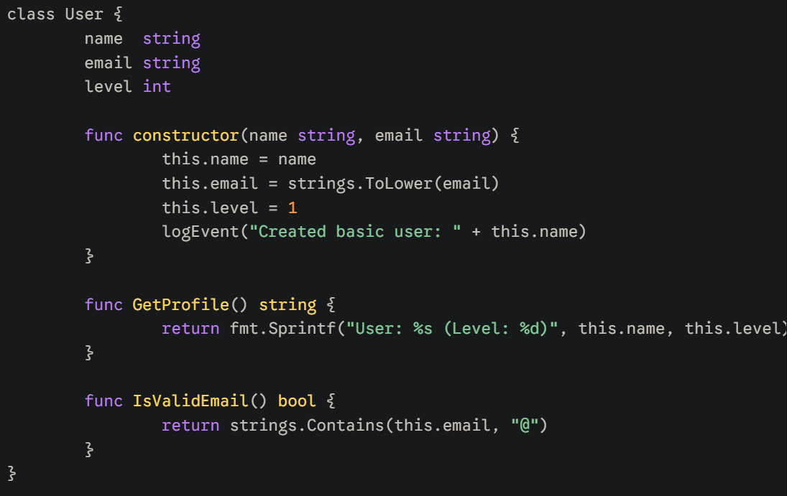

# GOO — Classes for Golang




**GOO** is an experimental transpiler that brings "classic" Object-Oriented syntax (classes, inheritance, constructors) to the Go programming language.

> [!IMPORTANT]  
> **This is a PET project created for fun.** > It was built as an experiment in code parsing and syntactic sugar. Do not use this in production environments (unless you are a chaotic neutral genius).

---

## What can GOO do?

GOO allows you to write code in a Java/C# style that is instantly transformed into idiomatic Go:

* **Classes**: Defined blocks for data and logic instead of scattered structs and methods.
* **Inheritance**: Simple embedding using the `extends` keyword.
* **Constructors**: A special `constructor` method for object initialization.
* **This Pointer**: Use the familiar `this`, which is automatically converted to `self` (the method receiver).
* **Mixed Code**: You can seamlessly mix standard Go code and Goo classes in the same file.

---

## How it works

Unlike simple regex-based tools, GOO uses a **bracket-balancing scanner**. This allows it to correctly capture method bodies even if they contain nested `if`, `for`, or `switch` blocks, ensuring that your logic remains intact during translation.


### Code Example (`app.goo`)

```javascript
package main

import "fmt"

class User {
    name string
    age  int

    func constructor(n string, a int) {
        this.name = n
        this.age = a
    }

    func SayHello() {
        fmt.Printf("Hello, I am %s and I am %d years old\n", this.name, this.age)
    }
}

class Admin extends User {
    role string
    
    func constructor(n string, a int, r string) {
        this.name = n
        this.age = a
        this.role = r
    }
}

func main() {
    // The transpiler generates New<ClassName> functions automatically
    u := NewUser("Bob", 25)
    u.SayHello()

    admin := NewAdmin("Alice", 30, "Root")
    fmt.Println("Admin role:", admin.role)
}
```

## Quick Start

1. **Build the transpiler:**
```bash
go build -o goo.exe main.go
```

2. **Transpile your file::**
```bash
./goo.exe input.goo output.go
```

3. **Run the result::**
```bash
go run output.go
```

## Why?

Go intentionally avoided classes in favor of composition, and for good reason. But sometimes it's fun to ask: *"What if...?"*. **GOO** is an exploration of that question, attempting to provide a familiar OOP feel while maintaining the underlying power and performance of Go.

## Contributing

If you have ideas for even wilder syntactic sugar (like automatic getters, decorators, or `new` keyword support), feel free to fork the repo and go nuts! This is a playground for those who love to tinker with language boundaries.

---
*Created with ❤️ by a Gopher who missed classes for exactly one evening.*